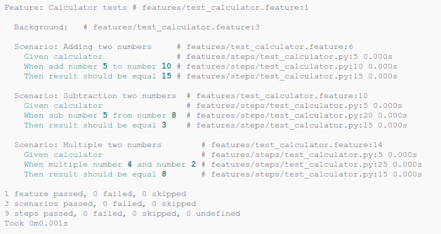

# Behave

Dedicated Python module for BDD tests.

* [Documentation](https://behave.readthedocs.io/en/stable/)
* [Source code](https://github.com/behave/behave)
* [Package page](https://pypi.org/project/behave/)



## Setup

```sh
pip3 install behave
```

## Run

```sh
behave
```

## Notes

* Behave can generate the steps code

## Report example

```txt
Feature: Calculator tests # features/test_calculator.feature:1

  Background:   # features/test_calculator.feature:3

  Scenario: Adding two numbers     # features/test_calculator.feature:6
    Given calculator               # features/steps/test_calculator_bahave.py:5 0.000s
    When add number 5 to number 10 # features/steps/test_calculator_bahave.py:10 0.000s
    Then result should be equal 15 # features/steps/test_calculator_bahave.py:15 0.000s

  Scenario: Subtraction two numbers  # features/test_calculator.feature:10
    Given calculator                  # features/steps/test_calculator_bahave.py:5 0.000s
    When sub number 5 from number 8   # features/steps/test_calculator_bahave.py:20 0.000s
    Then result should be equal 3     # features/steps/test_calculator_bahave.py:15 0.000s

  Scenario: Multiple two numbers        # features/test_calculator.feature:14
    Given calculator                    # features/steps/test_calculator_bahave.py:5 0.000s
    When multiple number 4 and number 2 # features/steps/test_calculator_bahave.py:25 0.000s
    Then result should be equal 8       # features/steps/test_calculator_bahave.py:15 0.000s

1 feature passed, 0 failed, 0 skipped
3 scenarios passed, 0 failed, 0 skipped
9 steps passed, 0 failed, 0 skipped, 0 undefined
Took 0m0.002s
```
