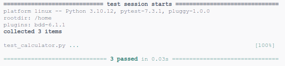

# pytest-bdd

The plugin giving support of Gherkin language into standard unit tests library **python**.

* [Documentation](https://pytest-bdd.readthedocs.io/en/stable/)
* [Package page](https://pypi.org/project/pytest-bdd/)
* [Source code](https://github.com/pytest-dev/pytest-bdd)



## Setup

The plugin to `pytest` module.

```sh
pip3 install pytest-bdd
```

## Run

```sh
pytest
```

## Report example

```txt
============================= test session starts ==============================
platform linux -- Python 3.10.12, pytest-7.3.1, pluggy-1.0.0
rootdir: /home
plugins: bdd-6.1.1
collected 3 items                                                              

test_calculator.py ...                                                   [100%]

============================== 3 passed in 0.03s ===============================
```

## Notes

* functions don't have to unique names when decorators are used
* **pytest-bdd** does not require special directory structure
* **pytest-bdd** can generate the steps code
* **pytest-bdd** does not support the classes (steps as method, context as internal fields)
* the report is simple **pytest** report

## Visual Code Support

The `pytest-bdd` can run with full debug support by following code in `lunch.json`:

```json
{
    "version": "0.2.0",
    "configurations": [
        {
            "name": "Python: Module",
            "type": "python",
            "request": "launch",
            "module": "pytest",
            "justMyCode": true
        }
    ]
}
```
