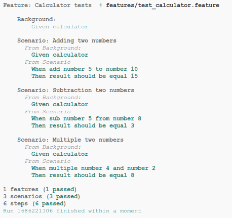

# Radish

> In addition to the standard gherkin language features which almost every BDD tool tries to implement radish implements uncommon but useful features like Scenario Loops, Scenario Preconditions and Variables.

* [Documentation](https://radish.readthedocs.io/en/stable/index.html)
* [Radish - the root from red to green](https://radish-bdd.github.io/)
* [Source code](https://github.com/radish-bdd/radish)
* [Package page](https://pypi.org/project/radish-bdd/)



## Setup

```sh
pip install radish-bdd
```

## Run

```sh
radish features/
```

Where `features` is a directory with feature files.

## Notes

* **radish** require (by default) existence of directory `~/radish` in order to work

## Report example

```
Feature: Calculator tests  # features/test_calculator.feature

    Background: 
        Given calculator

    Scenario: Adding two numbers
      From Background: 
        Given calculator
      From Scenario
        When add number 5 to number 10
        Then result should be equal 15

    Scenario: Subtraction two numbers
      From Background: 
        Given calculator
      From Scenario
        When sub number 5 from number 8
        Then result should be equal 3

    Scenario: Multiple two numbers
      From Background: 
        Given calculator
      From Scenario
        When multiple number 4 and number 2
        Then result should be equal 8

1 features (1 passed)
3 scenarios (3 passed)
6 steps (6 passed)
Run 1686168056 finished within a moment
```

## Visual Studio support

In case of `radish` it is more complicated, the library is not called as module. I improvised something like this:

```json
{
    "version": "0.2.0",
    "configurations": [
        {
            "name": "Radish",
            "type": "python",
            "request": "launch",
            "program": "/home/dplocki/.local/bin/radish",
            "args": [ "features/"],
            "console": "integratedTerminal",
            "justMyCode": true
        }
    ]
}
```

So for test to be able to load the module (`calculator` in my case) I have added the file `run.py`, which is a copy of the `~/.local/bin/radish`, but placed in the project root directory.

For Docker sufficient is `CMD PYTHONPATH=. radish features/`.
